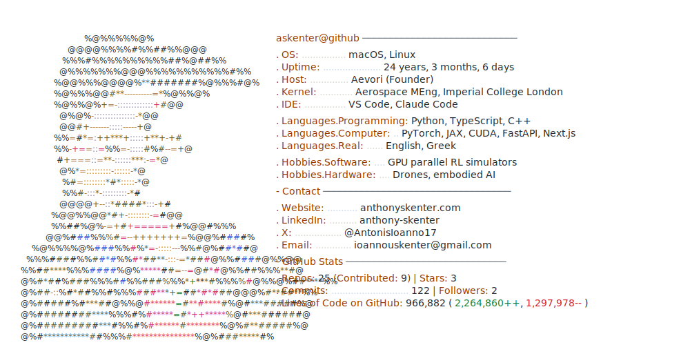

<picture>
  <source media="(prefers-color-scheme: dark)" srcset="dark_mode.svg">
  
</picture>

  <a href="https://anthonyskenter.com">anthonyskenter.com</a> ·
  <a href="https://www.linkedin.com/in/anthony-skenter">LinkedIn</a> ·
  <a href="https://x.com/AntonisIoanno17">X</a> ·
  <a href="mailto:ioannouskenter@gmail.com">Email</a>

Layout inspired by <a href="https://github.com/Andrew6rant">Andrew6rant</a>. Pipeline documented in <a href="docs/profile-readme">docs/profile-readme</a>.
